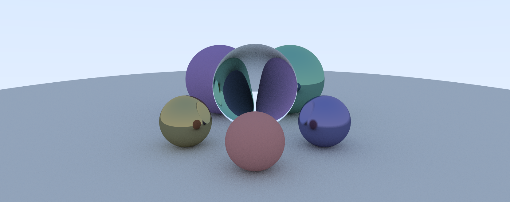

# raytracer 🔦

Implementation of a ray tracer in Rust.
Hobby project.
Guidance: https://raytracing.github.io

## Usage

```sh
raytracer <INPUT> --width=<WIDTH> --height=<HEIGHT> [OPTIONS]
```

You can control output, camera and rendering parameters with other options.
For example, the following command will produce a demo image of width 800 px, height 450 px, camera at `(0, 0, 1)` and a vertical field of view of 90 degrees:

```sh
raytracer ./inputs/github.json -w=800 -h=450 -c=0,0,1 --fov=90
```

For a list of all available options, see the help message with:

```sh
raytracer -H   # or --help
```

## Build & Run

If you haven't already, install the [Rust toolchain](https://www.rust-lang.org/tools/install).
You can either clone this repository or if you don't know how, download the source code by clicking on the green `<> Code` button above.

> [!NOTE]
> The following commands utilize the `release` profile, as the resulting executable is substantially faster (at the expense of compile time).
> For debug information, use the `dev` profile by omitting the `-r/--release` flag.

You can build and run the program with the following command:

```sh
cargo run -rq -- -w=<WIDTH> -h=<HEIGHT> [OPTIONS]
```

On the first execution this will compile the binary, which might take a little time.
Successive executions will be faster, provided no source code has been changed.

> [!TIP]
> Another performance optimization you can do is compiling the binary strictly for your specific CPU by setting the `target-cpu` compiler flag:
>
> ```
> RUSTFLAGS="-C target-cpu=native" cargo run -rq -- -w=<WIDTH> -h=<HEIGHT> [OPTIONS]
> ```

### Executable

If you've run the commands above, the executable will be located in the `target/release` subdirectory.
Otherwise, you can compile the binary with:

```sh
cargo build --release
```

## References

_Peter Shirley, Trevor David Black, Steve Hollasch:_ [Ray Tracing in One Weekend Series](https://raytracing.github.io).
